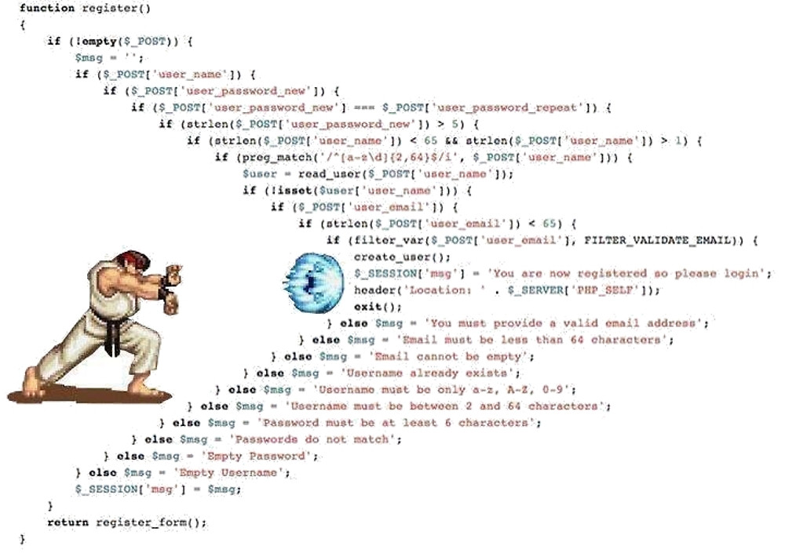

# 如何优雅的写好原生js

要求：实现红绿灯效果（每次间隔`2`秒变换灯的颜色）

html：
``` html
<ul id="traffic">
    <li><span></span></li>
    <li><span></span></li>
    <li><span></span></li>
</ul>
```
css：
``` css
#traffic li{
    display: block;
}
#traffic span{
    display: inline-block;
    width: 50px;
    height: 50px;
    background-color: gray;
    border-radius: 50%;
    margin: 5px;
}
#traffic.stop li:nth-of-type(1) span{
    background-color: red;
}
#traffic.wait li:nth-of-type(2) span{
    background-color: yellow;
}
#traffic.pass li:nth-of-type(3) span{
    background-color: green;
}
```
- 版本1
``` javascript
var traffic = document.getElementById('traffic')
;(function reset(){
    traffic.className = 'stop'
    setTimeout(function(){
        traffic.className = 'wait'
        setTimeout(function(){
            traffic.className = 'pass'
            setTimeout(reset,2000)
        }, 2000)
    }, 2000)
})()
```
- 优点：简单粗暴

- 缺点：回调地狱
### 俊哥：我写了三年js，就没有见过你这么烂的代码


---

- 版本2
``` javascript
var traffic = document.getElementById('traffic')
var currentStateIndex = 0
var stateList = ['stop', 'wait', 'pass']
setInterval(function(){
    traffic.className = stateList[currentStateIndex]
    currentStateIndex = (currentStateIndex + 1) % stateList.length
}, 2000)
```
- 优点：可`配置`参数

- 缺点：存在`全局变量`currentStateIndex、stateList

---

- 版本3
``` javascript
var traffic = document.getElementById('traffic')
var start = function(traffic, stateList){
    var currentStateIndex = 0
    setInterval(function(){
        traffic.className = stateList[currentStateIndex]
        currentStateIndex = (currentStateIndex + 1) % stateList.length
    }, 2000)
}
start(traffic, ['stop', 'wait', 'pass'])
```
- 优点：减少了`全部变量`

- 缺点：可`复用性`差

---

- 版本4
``` javascript
var traffic = document.getElementById('traffic')
var poll = function (...fnList) {
    var pollIndex = 0
    return function (...args) {
        var fn = fnList[pollIndex++ % fnList.length]
        return fn.apply(this, args)
    }
}
var setState = function (state) {
    traffic.className = state
}
var trafficStatePoll = poll(setState.bind(null, 'stop'), setState.bind(null, 'wait'), setState.bind(null, 'pass'))
setInterval(trafficStatePoll, 2000)
```
- 优点：抽象出了高阶函数`poll`,有点意思

- 缺点：一个简单的效果真的要写这么复杂？

### 产品经理：这个红绿灯怎么可能是`2`秒一变呢，改成间隔`1`、`2`、`3`秒


尴尬了，回到版本1？
``` javascript
var traffic = document.getElementById('traffic')
;(function reset(){
    traffic.className = 'stop'
    setTimeout(function(){
        traffic.className = 'wait'
        setTimeout(function(){
            traffic.className = 'pass'
            setTimeout(reset,3000)
        }, 2000)
    }, 1000)
})()
```
poll函数的复用
``` javascript
var traffic = document.getElementById('traffic')
var poll = function (...fnList) {
    var pollIndex = 0
    return function (...args) {
        var fn = fnList[pollIndex++ % fnList.length]
        return fn.apply(this, args)
    }
}
var setState = function (state) {
    traffic.className = state
}
var trafficStatePoll = poll(setState.bind(null, 'stop'), setState.bind(null, 'wait'), setState.bind(null, 'pass'))
// setInterval(trafficStatePoll, 2000)
var wait = poll(() => 1000, () => 2000, () => 3000)
;(function start(){
    trafficStatePoll()
    setTimeout(function(){
        trafficStatePoll()
        setTimeout(start, wait())
    }, wait())
})()
```
回调函数——更优雅的方式?
- ## Promise
``` javascript
var traffic = document.getElementById('traffic')
var wait = function(time){
    return new Promise(function(resolve){
        setTimeout(resolve, time)
    })
}
var setState = function(state){
    traffic.className = state
}
var reset = function(){
    Promise.resolve()
        .then(setState.bind(null, 'stop'))
        .then(wait.bind(null, 1000))
        .then(setState.bind(null, 'wait'))
        .then(wait.bind(null, 2000))
        .then(setState.bind(null, 'pass'))
        .then(wait.bind(null, 3000))
        .then(reset)
}
reset()
```
- ## Generator
``` javascript
function* ascReadFile() {
    yield wait(1000)
    yield wait(2000)
    yield wait(3000)
}
var start = function () {
    let g = ascReadFile()
    setState('stop')
    g.next().value.then(data => {
        setState('wait')
        return g.next().value
    }).then(data => {
        setState('pass')
        return g.next().value
    }).then(data => {
        start()
    })
}
start()
```
- ## async / await
``` javascript
async function asyncReadFile() {
    setState('stop')
    let a = await wait(1000)
    setState('wait')
    let b = await wait(2000)
    setState('pass')
    let c = await wait(3000)
    asyncReadFile()
}
asyncReadFile()
```